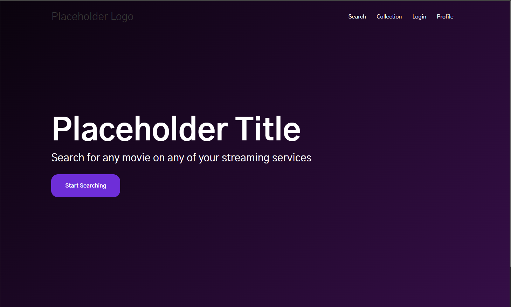
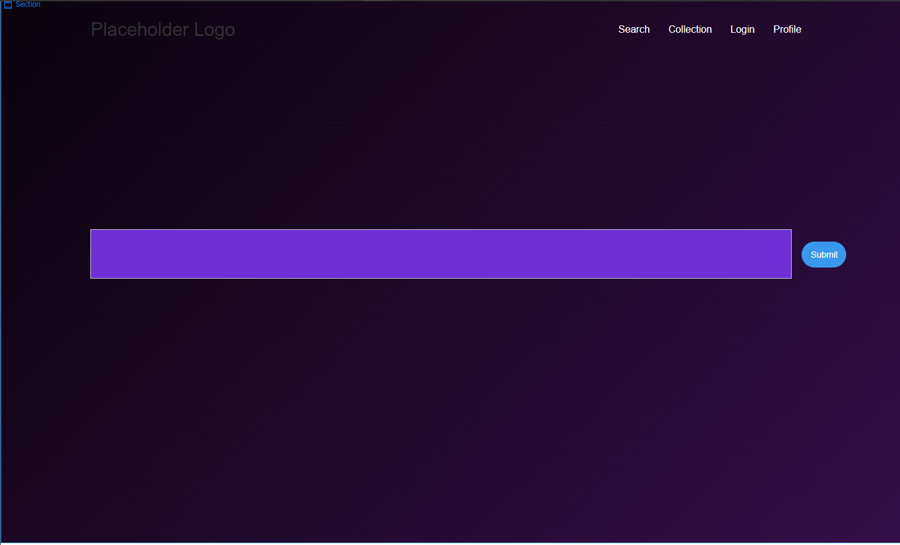
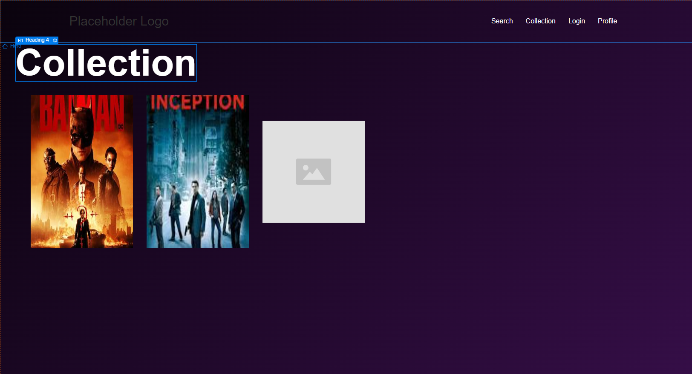

# Project Title

## Overview

My app's core is a search function for looking up movies from different streaming services all in one place. While the user will not be able to actually watch anything on the platform, they will be able to tell the app whcich streaming services they own, and then the searchbar will include only those services in the search.

### Problem

There have been many times in the past where I've looked up a movie on Netflix and found that it wasn't on there and then proceed to login in to every other one of my streaming services just to search the same movie, only to find it wasn't on any of them. The purpose of this app is to remove that process and make a one-stop to replace it.

### User Profile

The target audience is anyone from teenagers to people well into adulthood who use a streaming service to watch content, primarily people in their 20's. It is meant to start out as a website but also be adjusted into a mobile app (will not be done for the demo). My app will have to have clear and concise, short instructions for any navigation. It is important that things are easy and quick to read. This app isn't designed for the user to spend hours on. Targetted to spend 1~20 minutes depending on why they are there.

### Features

 -> Searchbar - Core feature
 -> Selection of streaming services - Will be viewable as a filter component
 -> An equivalent to MyList or something similar to mark down movies to watch
 -> Movie details Page for a selected movie
 -> User login - username, password, email
 -> Comments and adding comments to individual movies
 -> Database?????

## Implementation

### Tech Stack

Definites -> React, HTML, SASS, Node, Express

Maybes -> mySQL, knex

### APIs

Reelgood API - https://data.reelgood.com/api-docs/api-documentation/

Possibly- Utelly, Streaming Availablity, OTT Details

### Sitemap

Home page/Large searchbar. This will be the main and core screen of the project. Starts with the Home Page screenshot, then animates over to the searchbar. The searchbar and dropdown take up the majority of the screen. Selecting a movie navigates to movie details page

There is a profile icon in the header which leads to the profile page, containing user information.

Collection page is equivalent to mylist/favorites on other sites. Will consist of movie components that will display a summary when hovered over. Can be clicked on to redirect to the movie page.

Movie details page. Contains in depth information on specific movie. Also possible to comment or add to collection on the page.

Comments will be undernath the Movie Details Page Used for each movie. Shows the list of comments for the movie as well as adding a new comment

### Mockups

#### Home Page

#### Searchbar

#### Collection Page

I'm not very good at designing things by hand. I've been having much greater success with shifting colors using css. Definitely a lot more to add.

### Data

Will use mySQL for users and comments. Users will have a foreign key to comments and a list of ids for movies in their collection. 

Comments will have a correlating user and a foreign key for the movie

Still debating between storing the movie data in my database or using the data from the GET requests.

### Endpoints

List endpoints that your server will implement, including HTTP methods, parameters, and example responses.

Routes: 

/home
/home?s={movieId}
/profile
/collection
/:movieId

Still working out the actual endpoints. I have a backup API I will be using, still trying to get in contact with Reelgood to get access to their API.

### Auth

I will have authorization, most likely using passport. I need to do further research to provide more details.

Profile and collection pages will both require authorization to access.
Searchbar, home, and video details will not.

## Roadmap

Use Fibonacci numbers for Story Points:
1 point: ~ 30 minutes to complete
2 points: ~ 1 hour to complete
3 points: ~ half a workday to complete
5 points: ~ whole workday to complete

**Backlog:**

Feature: create client      1

Feature: create server      1

Feature: create migrations  3

Feature: create seeds       1

Feature: GET list of movies by title    3

Feature: GET individual movie       2

Feature: Home Page/Searchbar    3      

Feature: User Auth      3

Feature: Video Details      3

Feature: Collection     2~3

Feature: Profile        2~3

Feature: GET Comments   2

Feature: POST Comment   2

Feature: Comments Front-End      2

Bug Fixes

Demo Day ***4/19***

## Nice-to-haves

Video for the trailer of the movie

Filters for the search

More services than 3 or 4
